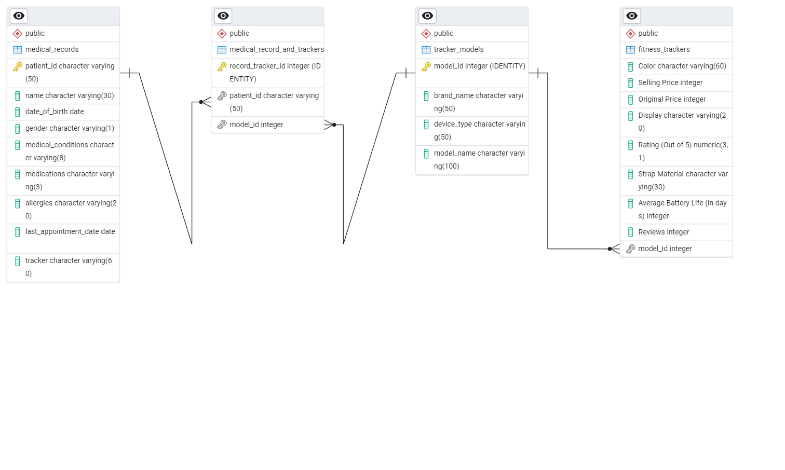

# HealthFit-Innovations

HealthFit Innovations, a healthcare technology company, is developing **HealthTrack**, a platform designed to transform healthcare data collection, analysis, and utilization. The platform integrates data from wearables, electronic health records (EHRs), medical imaging systems, and patient-reported outcomes to provide personalized health insights, real-time monitoring, and predictive analytics.

As HealthTrack’s user base expands, the platform is experiencing significant challenges in scaling its database infrastructure due to the massive influx of diverse health data, including heart rate, sleep patterns, activity levels, and blood glucose levels. The existing database management system (DBMS) is struggling with:

- Performance bottlenecks caused by real-time data processing demands  
- Data silos preventing seamless integration of data from multiple sources  
- Inefficient tracking of wearable devices, making it difficult to associate specific devices with user health outcomes

To address these challenges, HealthFit seeks a scalable and efficient relational database solution that can handle large volumes of dynamic health data, support real-time analytics, and enable seamless integration across different data sources.

---

## Project Overview

This project focuses more on **relational database modelling** than on database querying. The tool used is **PostgreSQL**.

The goal is to create a normalized, scalable schema that ensures data integrity while representing real-world healthcare and device-tracking relationships.

---

## Entity-Relationship Diagram

The ERD below illustrates the database schema and relationships between the core tables:

---

## Final Data Model

To ensure scalability, flexibility, and efficiency, I created a relational database with the following core tables:

1. **`medical_records` Table**  
   - Stores patient demographics, health conditions, medications, allergies, and the fitness tracker preference  
   - **Primary Key:** `patient_id`

2. **`tracker_models` Table**  
   - Details of fitness tracker models (e.g., brand name, device type, model name)  
   - **Primary Key:** `model_id`

3. **`fitness_trackers` Table**  
   - Captures detailed information about fitness tracker variants (e.g., colour, price, display type, strap material, battery life)  
   - **Primary Key:** `tracker_id`  
   - **Foreign Key:** Links to `tracker_models` via `model_id`

4. **`medical_record_and_trackers` Table** (Junction Table)  
   - Establishes a many-to-many relationship between `medical_records` and `tracker_models`  
   - **Primary Key:** Composite key (`patient_id`, `model_id`)

---

### Table Relationships

- `medical_records` ➡ `medical_record_trackers` (One-to-Many)  
- `tracker_models` ➡ `medical_record_trackers` (One-to-Many)  
- `tracker_models` ➡ `fitness_trackers` (One-to-Many)  

---

## Source Data

The database schema was designed using two initial datasets:

- A **fitness tracker table** containing:  
  `Brand Name, Device Type, Model Name, Color, Selling Price, Original Price, Display, Rating (Out of 5), Strap Material, Average Battery Life (in days), Reviews`

- A **medical records table** containing:  
  `patient_id, name, date_of_birth, gender, medical_conditions, medications, allergies, last_appointment_date, Tracker`

---

## 🧪 Sample Query Snapshots

Here are a few representative I queries built on the model:

**Query 1 – Count of Patients by Age Group**  

Categorizes patients into age groups to analyze demographic distribution.

**Query 2 – Patients Without a Fitness Tracker**

Identifies patients who have not used or been associated with any tracker.

**Query 3 – Count of Patients Per Fitness Tracker Brand**

Determines the most commonly used tracker brands among patients.

## 📂 Explore the SQL Files

For more insight into how the database was implemented and tested, check out the folders below:

- 📁 [`Data import and modelling`](Data%20import%20and%20modelling)  
  Contains the SQL scripts used for:
  - Importing raw data  
  - Cleaning and transforming values  
  - Creating and modeling normalized tables

- 📁 [`Queries`](Queries)  
  Contains the 3 sample query files I designed for analysis and reporting.  
  ➕ *Index creation commands are commented out for testing purposes. Indexing was tested and found to improve query runtime.*

---
